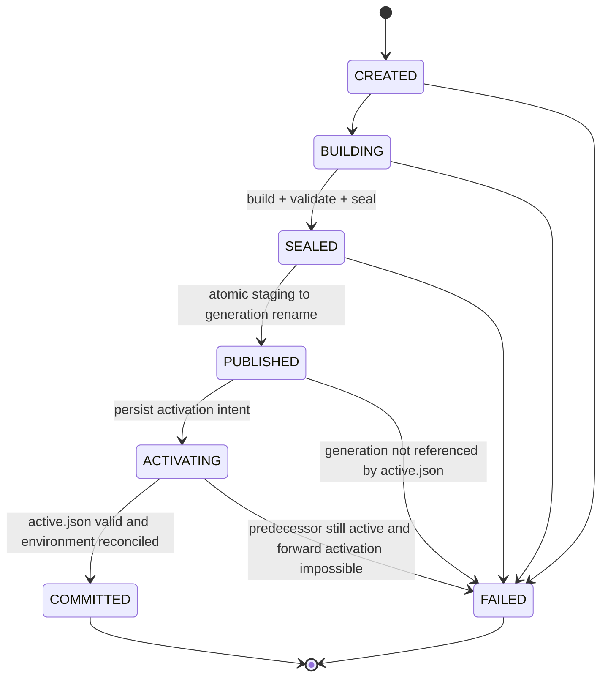

# YORVA Phase 3 — Generation Installation Architecture

> Document type: Owner-directed architecture design (reviewed)  
> Status: OWNER-APPROVED 2026-08-18 / IMPLEMENTATION BATCH-GATED  
> Date: 2026-08-18  
> Reviewed HEAD: `fdf8c9a3b07344099998bd5534ce96091b25fa77`  
> Reviewed branch: `fix/phase3-audit-r6-remediation`  
> Amendments: `002A3` (Phase 2), `003A4` (Phase 3)  
> ADR: `ADR-0006`  
> Batches: `PHASE-003-generation-implementation-batches.md`  
> Historical gates: `AUDIT-003` through `AUDIT-003R6` remain FAIL; `AUDIT-003R7` remains PENDING  
> This document does not declare Phase 3 PASS, COMPLETE, FROZEN or ACCEPTED.

Owner approved this design and locked D1–D5 on 2026-08-18. Implementation is authorized only as the numbered batches. This document does not authorize a single-shot rewrite, merge, freeze, tag, destructive migration of an existing Hermes tree, or Phase 4.

### Owner-locked decisions (2026-08-18)

| ID | Decision |
| --- | --- |
| D1 | Phase 2 Discovery read-only parses `control/active.json` and locates the active generation. No stable launcher, shim, `current` junction, or other second state source. |
| D2 | `HERMES_HOME` stays `%LOCALAPPDATA%\hermes`. Official user data is not migrated. Managed generations stay under `generations\` and stay separate from user data. |
| D3 | `config-templates` failure is a warning and does not by itself block Seal. Executable, version, runtime validation, or generation integrity failure still blocks Seal. |
| D4 | GC: active generation forever; keep the latest previous committed generation; keep at most the latest failed lineage-proven generation/staging; collect only proven unreferenced YORVA dirs. Never GC unknown dirs or HERMES_HOME user data. |
| D5 | After the first generation `COMMITTED`, remove only PATH entries proven YORVA-managed (`hermes-agent\bin` written by YORVA, or a previous generation `\bin`). Do not delete or rewrite user-authored Hermes PATH entries. |

This design replaces the current candidate / quarantine / ownership-promotion journal. It does not add compensating states such as `ROLLED_BACK` or `ENV_APPLIED`.

Owner-fixed pipeline (unchanged):

```text
Install Transaction
→ Fresh Staging
→ Build
→ Validate
→ Seal
→ Publish Generation
→ Atomic Activate (active.json)
→ Reconcile Environment
→ Commit
→ GC
```

---

## 0. Snapshot verification

Verified against the live tree at `fdf8c9a`, not assumed from the brief:

| Claim in the brief | Verified fact |
| --- | --- |
| Dual persisted machines (SQLite Operation + promotion journal) | True. `operations` rows plus `%LOCALAPPDATA%\hermes\.yorva-phase3\promote-<id>.json`. |
| `RecoverPromotions` then warn-and-continue | True. `daemon.go:100-102` logs and continues; HTTP still starts. |
| Recovery looks up SQLite Operation for nonce | True. `HostInstaller.WithOperationLookup` → `database.GetOperation`. |
| Retry infers directory owner from previous Operation | True. `runtime_install_run.go:117-119` + `ValidateTarget(previous)`. |
| Empty canonical dir accepted at preflight | True. `target.go` treats `ReadDir` length 0 as absent. |
| Promotion treats any existing dir as live | True. `promoteCandidate` requires previous proof when dest exists. |
| `path` launchers are signed before promotion on this HEAD | True for `fdf8c9a` (`materializeAuthenticatedLaunchers` then promote). Registry PATH still happens after journal `COMMITTED`. |
| Official installer honors `-InstallDir` / `-HermesHome` | True. Pinned `install.ps1` binds those flags; `venv`/`dependencies`/`bootstrap-marker` write `$InstallDir`; `uv`/`python`/`git`/`config-templates` write `$HermesHome`. |
| Frozen Phase 2 path | True. `candidates.go:60-72` only enumerates `%LOCALAPPDATA%\hermes\hermes-agent\bin\hermes.exe` and `...\venv\Scripts\hermes.exe`. |
| No Phase 3 tag | True. |
| Historical AUDIT reports immutable | True; not modified by this design. |

Working-tree noise at review (`LICENSE`/`NPM-LICENSE` EOL, untracked `.wxs`, untracked brief) is not part of `fdf8c9a` and is not a design input.

---

## 1. Why the current machine cannot be patched

The current model has five independently persisted or observed domains that do not share a commit:

1. SQLite Operation (`PENDING`/`RUNNING`/`SUCCEEDED`/`FAILED`/`CANCELLED`).
2. Promotion journal (`PREPARED`/`OLD_QUARANTINED`/`NEW_PROMOTED`/`COMMITTED`).
3. Filesystem (work, candidate, live `hermes-agent`, quarantine, marker, temps).
4. HKCU `Environment` (`HERMES_HOME`, user `PATH`).
5. Accepted-installation cache and Phase 2 discovery.

That is already a double (really multi) state machine. Adding `ROLLED_BACK` or `ENV_APPLIED` would add more compensating states on the same broken commit boundary. The replacement therefore changes the transaction model: one InstallTransaction record, one active pointer, one sealed generation, environment as derived state.

---

## 2. Final directory model

Fixed managed root (not user-supplied, not HTTP-supplied):

```text
%LOCALAPPDATA%\hermes\                  # official HERMES_HOME; YORVA managed root
├─ control\
│  ├─ active.json                      # sole activation pointer
│  ├─ install.lock                     # OS-held lock only
│  └─ transactions\
│     └─ txn_<id>.json                 # sole in-flight/recovery record
├─ generations\
│  └─ gen_<id>\
│     ├─ generation.json               # lineage
│     ├─ manifest.json                 # integrity
│     ├─ bin\hermes.exe
│     ├─ venv\...
│     └─ ...sealed official tree...
├─ staging\
│  └─ txn_<id>\                        # fresh mutable InstallDir for this transaction
├─ failed\
│  └─ txn_<id>\                        # optional proven-YORVA diagnostic retention
├─ cache\                              # verified re-downloadable inputs only
├─ node\                               # Amendment 003A3 managed Node/npm (not a generation)
├─ .env, config.yaml, SOUL.md          # official Hermes mutable data
└─ cron\, sessions\, logs\, pairing\, hooks\,
   image_cache\, audio_cache\, memories\, skills\
```

Rules:

- Reserved YORVA names under the root: `control`, `generations`, `staging`, `failed`, `cache`.
- Official mutable data stays at the Hermes home root, because the pinned installer writes `$HermesHome\.env`, `config.yaml`, `SOUL.md`, `skills`, `sessions`, `logs` and related directories. A separate `mutable-data\` tree is **not** introduced unless a later Owner decision changes official `HERMES_HOME`.
- Managed Node remains `%LOCALAPPDATA%\hermes\node` (003A3). It is a prerequisite artifact, never an activatable generation.
- `yorvad` SQLite / Operation logs stay in the daemon data directory, not under Hermes home.
- Staging `InstallDir` is `staging\txn_<id>`. Official `-HermesHome` remains `%LOCALAPPDATA%\hermes`.
- Generation directory name is only `gen_<closed-id>`. Absolute paths never select a target.
- After Seal, nothing in `generations\gen_<id>\` is written except by GC deletion of a **non-active**, lineage-valid, unreferenced generation.

`mutable-data\` is omitted from the implemented layout unless Owner later requires relocating official Hermes user files. Relocating them would change Hermes runtime data paths and is an Owner product decision.

---

## 3. Final state machine

### 3.1 Authoritative transaction states

Forward-only. `Step` is progress projection, not a persisted sub-state.



Normal sequence:

```text
CREATED
→ BUILDING
→ create empty staging/txn_<id>
→ build (source, official stages against staging InstallDir, YORVA launcher copy)
→ validate layout, version, regular executables
→ write manifest.json + generation.json, second walk, seal
→ SEALED
→ rename staging/txn_<id> → generations/gen_<id>
→ PUBLISHED
→ persist ACTIVATING + ActiveBefore*
→ atomic replace control/active.json
→ read back pointer and seal
→ reconcile HKCU from active.json
→ COMMITTED
→ project Operation SUCCEEDED
→ best-effort GC
```

Convergence rules:

- If `active.json` already names this generation with a valid seal, recovery always rolls **forward** to environment reconcile / `COMMITTED`, even if the record still says `PUBLISHED` or `ACTIVATING`.
- `FAILED` is illegal while `active.json` names this generation. That observation is `ACTIVATING`/`COMMITTED`, never delete.
- GC failure never moves `COMMITTED` to `FAILED`.
- There is no `ROLLED_BACK`, `ENV_APPLIED`, `OLD_QUARANTINED` or `NEW_PROMOTED`.

### 3.2 Daemon install-subsystem gate

Separate from transaction state. Observed at startup after lock + recover:

| Gate | Meaning | New install / prerequisite mutation |
| --- | --- | --- |
| `READY` | at most one consistent world; environment reconciled or not required | allowed |
| `RECONCILING` | recovery/environment in progress under the lock | rejected (`INSTALL_NOT_READY`) |
| `BLOCKED_UNSAFE` | ambiguous or unrecoverable managed state | rejected (`INSTALL_BLOCKED_UNSAFE`) |

Read-only health and Phase 2 discovery may stay up when safe. Warning-and-continue after failed recovery is forbidden.

---

## 4. InstallTransaction schema and persistence

Authoritative file: `control/transactions/txn_<id>.json`.

```go
type TransactionState string // CREATED BUILDING SEALED PUBLISHED ACTIVATING COMMITTED FAILED

type InstallTransaction struct {
    Schema                 int               `json:"schema"`    // 1
    Revision               uint64            `json:"revision"`  // monotonic, CAS under lock
    ID                     string            `json:"id"`        // txn_<22-char base32>
    RuntimeKind            string            `json:"runtimeKind"`
    OperationID            string            `json:"operationId"` // projection only
    GenerationID           string            `json:"generationId"` // gen_<22-char base32>
    State                  TransactionState  `json:"state"`
    Step                   string            `json:"step"` // progress only
    SourcePin              string            `json:"sourcePin"`
    ExpectedVersion        string            `json:"expectedVersion"`
    StagingRelativePath    string            `json:"stagingRelativePath"`    // staging/txn_<id>
    GenerationRelativePath string            `json:"generationRelativePath"` // generations/gen_<id>
    ManifestSHA256         string            `json:"manifestSha256"`
    SealSHA256             string            `json:"sealSha256"`
    ActiveBeforeGeneration string            `json:"activeBeforeGeneration"`
    ActiveBeforeDigest     string            `json:"activeBeforeDigest"`
    ErrorCode              string            `json:"errorCode"`
    CreatedAt              time.Time         `json:"createdAt"`
    UpdatedAt              time.Time         `json:"updatedAt"`
    SealedAt               *time.Time        `json:"sealedAt"`
    PublishedAt            *time.Time        `json:"publishedAt"`
    ActivatedAt            *time.Time        `json:"activatedAt"`
    CommittedAt            *time.Time        `json:"committedAt"`
}
```

Persistence rules:

- same-directory exclusive temp → write → file sync → close → parent-dir sync → atomic replace (`MoveFileEx` `MOVEFILE_REPLACE_EXISTING|MOVEFILE_WRITE_THROUGH`) → parent-dir sync → read-back;
- any durability call failure is an error; after a successful replace, recovery treats a complete new record as the new truth even if the caller later saw a sync error;
- no absolute paths;
- no nonce, no HMAC-over-Operation, no raw stderr, no user filesystem paths;
- SQLite must not copy `State`, generation id as activation, or retry-ownership fields.

Creation order (eliminates “PENDING with no worker” as recovery authority):

```text
allocate txn_id + op_id + gen_id
→ persist InstallTransaction CREATED
→ persist Operation PENDING with details.transactionId = txn_id
```

If SQLite insert fails, mark the transaction `FAILED` (no staging yet). If the process dies between the two writes, recovery sees `CREATED` with no staging and marks `FAILED`. Filesystem is untouched.

Retry always allocates a new `txn_id`, new staging path and new `gen_id`. It never resumes staging and never consults `PreviousRuntimeInstall` for directory ownership.

---

## 5. Active pointer contract

`control/active.json` is the only activation commit.

```json
{
  "schema": 1,
  "runtimeKind": "hermes",
  "generationId": "gen_<id>",
  "generationRelativePath": "generations/gen_<id>",
  "manifestSha256": "<hex>",
  "sealSha256": "<hex>",
  "sourcePin": "df4b65147d7ddd74dd449f9067aabbca5aef0ec7",
  "version": "0.20.2",
  "transactionId": "txn_<id>",
  "activatedAt": "<UTC RFC3339Nano>"
}
```

Rules:

- persist `ACTIVATING` (with `ActiveBefore*`) **before** replacing the pointer;
- accept only a relative path `generations/gen_<closed-id>` contained in the managed root;
- validate published generation + seal before replace;
- same atomic writer as the transaction record;
- read back pointer and re-validate seal;
- missing or corrupt `active.json` means “no YORVA-managed active generation”, never “pick newest `generations/*`”;
- activation never renames, junctions or deletes the predecessor generation;
- no SQLite `active_generation` column, no `current` directory, no `hermes-agent` swap.

---

## 6. Seal, lineage, integrity, provenance, deletion

These four are different authorities.

### 6.1 Lineage — `generation.json`

Binds: schema, transaction id, generation id, runtime kind, source pin, expected version, relative generation path, manifest digest, timestamps, random lineage identity.

Lineage answers: “did YORVA publish this directory through a known transaction?” It is not anti-malware.

### 6.2 Integrity — `manifest.json`

Complete sorted list of relative paths, sizes and SHA-256. Exclude **only** the two root files `generation.json` and `manifest.json`. Do **not** exclude a basename prefix (no `.yorva-atom-` tree-wide ignore).

Seal procedure:

1. all installer processes and descendants have exited and been reaped;
2. all files closed;
3. repository, venv, dependencies, templates, bootstrap marker and `bin/hermes.exe` plus `bin/hermes-acp.exe` are present in staging;
4. write `manifest.json` atomically;
5. write `generation.json` atomically;
6. second full walk must match the manifest;
7. no further writes into that tree.

### 6.3 Provenance

Provenance is the closed build policy: pinned official commit and digest, pinned Node/npm, closed argv/environment, Job Object containment, protocol/manifest verification. An allowed filename is not provenance. Same-user writers during build remain a residual race; Seal happens only after processes exit, which closes the post-build window. Stronger same-user resistance is deferred (section 15.10).

### 6.4 Deletion authority

Automatic delete requires **all** of:

- path canonically contained in `staging`, `failed`, `cache` or `generations`;
- directory id equals a transaction or generation id in a valid record;
- generation is not named by current `active.json`;
- no nonterminal transaction references it;
- regular directory, no reparse on the path or ancestors;
- D4 retention allows it.

D4 retention (locked):

- the generation named by `active.json`: never collect;
- the single most recent previously committed generation that is not active: keep;
- at most one latest failed lineage-proven staging or generation directory: keep;
- older proven, unreferenced YORVA staging / failed / generations: eligible;
- unknown directories, legacy `hermes-agent`, and HERMES_HOME user data (`.env`, `config.yaml`, `SOUL.md`, `skills`, `sessions`, `logs`, …): never collect.

---

## 7. Environment reconcile

Environment is derived. It is not a transaction sub-state.

Desired state is a pure function:

```text
Desired = ComputeEnvironmentPlan(valid active.json, validated generation, fixed policy, observed HKCU\Environment)
```

Fixed policy (verified against pinned `install.ps1`):

| Value | Desired |
| --- | --- |
| `HERMES_HOME` | `%LOCALAPPDATA%\hermes` |
| user `PATH` prefix | `<managed-root>\generations\<active-gen>\bin` |
| remove only if proven YORVA-managed and stale (D5) | previous generation `\bin`, and `...\hermes-agent\bin` only when YORVA wrote that entry; never user-authored Hermes PATH |

Algorithm:

```text
ResolveAndValidateActive
→ ReadObservedEnvironment
→ plan = ComputeEnvironmentPlan(desired, observed)
→ apply only missing/different managed values (HERMES_HOME first, then PATH)
→ read back
→ verify required values
→ best-effort WM_SETTINGCHANGE
```

Rules:

- crash after `HERMES_HOME` and before `PATH` is repaired at next reconcile;
- daemon post-check and Phase 2 (after amendment) resolve the generation executable by `active.json`, never by inherited `PATH`;
- environment failure leaves the transaction `ACTIVATING` and **never** rolls back `active.json`;
- startup reconciles environment before `READY`;
- after `COMMITTED`, later registry drift is repaired from `active.json` without reopening the transaction;
- unrelated `PATH` entries stay.

Official `Set-PathVariable` is **not** spawned. YORVA owns launcher copy (before Seal) and registry reconcile (after Activate).

---

## 8. Complete recovery matrix

Recovery is:

```text
Acquire install.lock
→ ObserveStore (transactions, staging, generations, active.json, environment)
→ Classify records (valid / malformed / duplicate)
→ D = DecideRecovery(observation)   // pure; no SQLite Operation
→ Execute(D)
→ Observe again
→ D2 = DecideRecovery(observation2)
→ D2 is no-op or strictly forward, else BLOCKED_UNSAFE
→ set gate READY | BLOCKED_UNSAFE
```

`DecideRecovery` inputs are only: transaction bytes, filesystem observation, `active.json`, observed registry. Never Operation status, never “latest directory”, never PATH as activation.

### 8.1 Transaction × filesystem × active

| Txn | Staging | Generation | Active pointer | Decision |
| --- | --- | --- | --- | --- |
| none | unknown/legacy/extra dir | any | any | never delete; diagnose; block mutation only if a reserved id collides |
| none | absent | absent | missing/malformed | READY; no managed generation |
| none | absent | valid gens, none active | missing | READY; do not auto-activate newest |
| CREATED | absent | absent | pred/none | `FAILED`; no FS mutation |
| CREATED | present (empty or not) | absent | pred/none | if staging id matches txn: move to `failed/` if non-empty proven YORVA, else remove empty staging; `FAILED` |
| CREATED | absent | matching gen exists | pred/none | inconsistent publish-without-state; fail closed |
| BUILDING | mutable | absent | pred/none | never resume; retain/move proven staging to `failed/`; `FAILED` `OPERATION_INTERRUPTED` |
| BUILDING | absent | absent | pred/none | `FAILED` `OPERATION_INTERRUPTED` |
| BUILDING | absent | matching gen | pred/none | fail closed (build should not have published) |
| SEALED | valid sealed | absent | pred/none | publish rename; then `PUBLISHED` |
| SEALED | absent | valid matching seal | pred/none | infer rename done; `PUBLISHED` |
| SEALED | invalid/unsealed | absent | pred/none | preserve staging/failed; `FAILED`; never activate |
| SEALED | valid | valid same lineage | pred/none | ambiguous duplicate; `BLOCKED_UNSAFE` unless both walks match and staging is a leftover empty dir after rename (then delete only empty staging) |
| SEALED | valid | valid different lineage | any | `BLOCKED_UNSAFE` |
| PUBLISHED | absent | valid | predecessor | persist `ACTIVATING`; activate forward |
| PUBLISHED | absent | valid | already this gen | infer activation; `ACTIVATING`; reconcile env |
| PUBLISHED | any | invalid/missing | pred/none | fail closed; keep predecessor |
| PUBLISHED | present | valid matching | pred/none | leftover staging after publish; do not activate staging; treat as `PUBLISHED` + GC-eligible staging if lineage matches and dest gen is complete |
| ACTIVATING | absent | valid | predecessor | complete `active.json` replace forward |
| ACTIVATING | absent | valid | already this gen | reconcile env; `COMMITTED` |
| ACTIVATING | any | valid | unrelated gen | `BLOCKED_UNSAFE`; do not guess |
| ACTIVATING | any | invalid/missing | pred or this | fail closed; keep whatever valid predecessor/evidence exists; never delete |
| ACTIVATING | absent | valid | this gen; env incomplete | reconcile env; stay `ACTIVATING` until observed |
| COMMITTED | absent | valid | this gen | no txn action; optional global env reconcile |
| COMMITTED | leftover staging | valid | this gen | staging GC only if lineage-proven |
| FAILED | proven failed/staging | not this gen | any | never resume; retention GC only |
| FAILED | any | this gen | this gen | inconsistent; roll forward (`ACTIVATING`/`COMMITTED`); never delete active |
| malformed txn bytes | any | any | any | classify; do not parse as authority; `BLOCKED_UNSAFE` if it occupies a reserved name |
| two+ nonterminal txns | any | any | any | recover each once; if still >1 nonterminal → `BLOCKED_UNSAFE` |
| COMMITTED/FAILED history | any | any | valid other gen | history does not compete with `active.json` |

### 8.2 Crash windows from the current machine, and the replacement

| Current crash window | Replacement observation | Decision |
| --- | --- | --- |
| PENDING persisted, no worker | CREATED only, or CREATED+PENDING projection | `FAILED`, no FS |
| work/candidate before journal | staging exists, txn BUILDING or CREATED | never resume; `FAILED`; move proven staging |
| atomic temp leftover | temp next to a record | ignored by manifest (seal excludes only named seal files; temps are not in a sealed generation). Recovery deletes only `control/*.yorva-atom-*` that fail read-back and are exclusive-created by YORVA in `control/` |
| replace succeeded, final dir-sync failed | complete new record readable | treat as persisted; roll forward |
| PREPARED before old rename | no equivalent; old live never moves | n/a |
| old rename then journal lag | no live rename | n/a |
| restore quarantine, journal stale | no quarantine | n/a |
| candidate rename then journal lag | SEALED + gen present + staging absent | infer `PUBLISHED` |
| COMMITTED before env | ACTIVATING + active=new + env incomplete | reconcile; stay ACTIVATING |
| HERMES_HOME then PATH fail | same | resume reconcile |
| FS+registry done, Operation still RUNNING | txn COMMITTED or ACTIVATING+active=new | project SUCCEEDED/RUNNING from txn; never use Operation to undo FS |
| one bad journal blocks daemon | one bad txn | classify that record; other valid txns still considered; gate `BLOCKED_UNSAFE` only if world is ambiguous; never warn-and-serve mutations |

### 8.3 Lock

- `control/install.lock` is opened and locked with `LockFileEx` (exclusive, fail-immediately or short bounded wait).
- The holding process is `yorvad`.
- Process crash releases the lock; the file may remain. File presence is not a lock.
- Recovery and transaction create both require the held lock.
- A second yorvad must not break the lock.

---

## 9. Phase 2, legacy and CLI

These are **frozen-contract** items. Implementation must not start until Owner accepts the choices below.

### 9.1 Decision (recommended): formal Phase 2 amendment, not a new binary

Phase 2 today only looks at:

```text
%LOCALAPPDATA%\hermes\hermes-agent\bin\hermes.exe
%LOCALAPPDATA%\hermes\hermes-agent\venv\Scripts\hermes.exe
```

Generations live at `generations\gen_<id>\`. Silently teaching discovery to follow `active.json` would change a frozen Phase 2 contract. A new YORVA `hermes.exe` shim at the old path would be a new binary and a second activation mechanism.

**Recommended governed solution:** Amendment `002A2` (or a Phase-3-linked Phase 2 amendment) adding one read-only resolver:

```text
if control/active.json exists and validates
    selected = <managed-root>/<generationRelativePath>/bin/hermes.exe
    do not enumerate the legacy hermes-agent launchers as competing candidates
else
    existing frozen enumeration unchanged
```

Fallback 002A1 Python entry remains available **inside the active generation root only**, never across a mix of legacy and generation trees.

A stable Go launcher at the old path is the alternative if Owner requires `hermes` to work with a PATH that still points at `hermes-agent\bin`. This design does **not** choose that binary.

### 9.2 Legacy coexistence

- Never adopt, move, junction or delete `%LOCALAPPDATA%\hermes\hermes-agent`.
- First successful generation `COMMITTED` leaves the legacy tree in place as untrusted evidence.
- After a valid `active.json`, discovery (post-amendment) returns a single selected generation launcher so `AMBIGUOUS` cannot occur from “legacy + generation”.
- Retry of a failed new install never writes into the legacy tree.

### 9.3 Terminal `hermes`

After `COMMITTED`, reconcile prepends `generations\<active>\bin` to user `PATH` and sets `HERMES_HOME` to `%LOCALAPPDATA%\hermes`. That is how a terminal gets `hermes`. No extra shim in this design.

### 9.4 Build-time installer flags

Verified: `-InstallDir` may be the staging path; `-HermesHome` stays `%LOCALAPPDATA%\hermes`. Official tools (`uv`, PortableGit) land under Hermes home; the sealed generation does not include those tools as activation content. `config-templates` mutate Hermes home, not the generation tree — they run as a **non-generation** side effect during BUILDING and must not be required for Seal. If templates fail, the transaction may still Seal if the generation tree itself validates; template failure is a recorded warning, not a second state. Owner may instead require templates to succeed before Seal — see section 15.

---

## 10. No double state machine

| Concern | Sole authority | Forbidden authorities |
| --- | --- | --- |
| in-flight intent / recovery | `control/transactions/txn_*.json` | Operation, UI, directory presence, PATH |
| which generation is active | `control/active.json` | txn state, newest dir, SQLite, junction, `hermes-agent` |
| sealed bytes | `manifest.json` + `generation.json` | allowlists, Operation, PATH |
| user-visible progress | SQLite Operation (projection) | recovery/activation |
| desired registry | valid `active.json` + fixed policy | Operation.Step, previous PATH |
| deletion | lineage + containment + “not active” + unreferenced | marker presence, prefix, “YORVA created something here” |
| concurrency | held OS lock | lock-file existence, SQLite UNIQUE alone |

One-way projections only:

```text
InstallTransaction → Operation status/stage/error
active.json        → environment desired plan
active.json + seal → Phase 2 selected candidate (after amendment)
txn + lineage      → GC eligibility
```

Forbidden reverse inference:

```text
Operation FAILED  ⇏  filesystem transaction failed
latest Operation  ⇏  generation owner
PATH entry        ⇏  active generation
directory exists  ⇏  lineage
manifest match    ⇏  provenance
```

There is no SQLite active flag, no `current` directory, no implicit latest-generation picker, and no promotion journal.

---

## 11. Current-file disposition

Call sites verified before this map. Removal happens only after generation tests pass (migration batch 10).

### 11.1 Remove

| Code | Why |
| --- | --- |
| `ownership_promote.go` | live/candidate rename + quarantine recovery |
| `ownership_journal.go` | `PREPARED`…`COMMITTED` journal |
| `ownership_delta.go` | stage-delta re-sign as ownership proof |
| `ValidateTarget` previous-Operation owner path in `target.go` | retry owner inference |
| `RecoverPromotions` / `WithOperationLookup` | SQLite-backed FS recovery |
| promotion/retry tests that encode old ownership | replace with generation tests; keep useful occupied/reparse fixtures |

### 11.2 Migrate

| Code | Becomes |
| --- | --- |
| `ownership_inventory.go` | generation manifest walker; drop prefix exclusion and exe-allowlist-as-ownership |
| `ownership_marker.go` / atomic writers | `generation.json` + `active.json` + txn writer |
| `ownership_atomic*.go` | shared atomic record helper |
| `host_installer.go` | Hermes Build + Validate against staging only |
| `host_path_windows.go` | `ComputeEnvironmentPlan` + idempotent apply/read-back |
| `runtime_install_run.go` | `InstallManager.Run`; project stages |
| `runtime_install.go` | new transaction per request; drop `PreviousRuntimeInstall` owner use |
| `daemon.go` | lock → recover → env reconcile → gate; no warn-and-continue |
| Phase 3 / SECURITY / DATA_MODEL | generation contracts; drop `ownership_nonce` as retry authority |

`ownership_nonce` on Operation may remain unused or be removed in a later migration once no reader remains. It must not authorize recovery.

### 11.3 Reuse unchanged

Verified source/archive acquisition and bounds; official pin/Node/npm; protocol verification; Job Object runner; cancel/timeout/output limits; reparse/containment (after handle/TOCTOU review); Phase 2 version parse; OpenAPI Operation/SSE/Desktop as projections; accepted-installation row as **cache**.

### 11.4 Packages

```text
services/node/internal/install/
  transaction.go
  transaction_store.go
  generation.go
  seal.go
  active_pointer.go
  recovery.go          # Observe, DecideRecovery, Execute
  environment.go
  gc.go
  manager.go
  lock_windows.go
  lock_other.go

services/node/internal/runtime/hermes/
  build.go             # staging InstallDir only
  validate_install.go
  version.go
  locate_executable.go # generation-root launchers for post-check
```

No plugin framework, no DI container, no generic package manager.

---

## 12. Ordered migration batches

Implementation is **not** authorized by this document. After Owner approval and required amendments/ADR:

1. Governance: Phase 3 amendment; ADR for generation transaction; **Phase 2 amendment 002A2** (or Owner-chosen launcher); legacy coexistence text.
2. Pure decision model + exhaustive `DecideRecovery` tests (no FS).
3. Atomic record store, lock, closed IDs, path guards.
4. Staging build + seal (all launchers before seal; second walk).
5. Publish rename + activate pointer; predecessor generation untouched.
6. Recovery executor + daemon gate (`READY` / `RECONCILING` / `BLOCKED_UNSAFE`).
7. Environment plan/apply/read-back; post-check independent of inherited PATH.
8. Operation projection; SQLite failure cannot drive FS.
9. Legacy: never adopt/delete; retry always fresh; discovery uses approved integration.
10. Remove old promotion/ownership machine only after generation tests pass.
11. Full verification, exact-commit CI/MSI, independent `AUDIT-003R7` or later.
12. No merge/freeze/tag/Phase 4 before audit PASS.

---

## 13. Failpoint matrix

Every failpoint test: persist bytes → kill → recover → recover again → assert section 14. `D2` is no-op or forward.

### 13.1 Atomic records (transaction, seal, active.json)

| Inject | Required outcome |
| --- | --- |
| before temp create | old record intact; no activation |
| after temp create, before write | old intact; temp cleaned or ignored |
| partial write | old intact; incomplete temp never activated |
| after write, before file sync | recover old or complete new by read-back; never half record |
| after file sync, before close | same |
| after close, before pre-replace dir sync | old intact if replace not done |
| after pre-replace dir sync, before replace | old intact |
| after replace, before final dir sync | if new record reads back complete → forward; else fail closed |
| after final sync, before read-back | complete new |
| after read-back, before caller revision update | recover from bytes on disk, not caller memory |

Never activate an unsealed generation.

### 13.2 Build and seal

| Inject | Required outcome |
| --- | --- |
| before/after staging mkdir | predecessor active untouched; retry new ids |
| during download/extract/copy | staging not published; no descendant leak |
| during venv/dependencies | same |
| during launcher copy | same |
| after launchers, before validate | no publish |
| during version/exec validate | no publish |
| during manifest walk | no seal |
| after manifest, before generation.json | no activate |
| after seal, before second walk | invalid seal not published |
| after SEALED, before rename | staging sealed; gen absent; recover publishes or fails without touching active |

### 13.3 Publish

| Inject | Required outcome |
| --- | --- |
| before staging→gen rename | SEALED; active predecessor |
| after rename, before PUBLISHED write | observe gen+seal, staging absent → PUBLISHED |
| during PUBLISHED record replace | old-or-new complete txn record |
| after PUBLISHED, before ACTIVATING | do not env-reconcile as committed |
| gen dest already exists, different bytes | fail closed |
| staging and gen both complete same lineage | fail closed or reviewed empty-staging leftover rule |
| missing/changed seal | never activate |
| reparse on source/dest/ancestor | fail closed |

### 13.4 Activation

| Inject | Required outcome |
| --- | --- |
| before/after ACTIVATING persist | predecessor remains until pointer replace |
| during active temp write/sync/close | old pointer intact or new complete |
| after active replace, before final sync | read-back decides |
| after pointer verifies, before env | ACTIVATING; no rollback |
| active=predecessor / new / unrelated / missing / malformed / absolute / escaping / seal mismatch | only `new`+valid is forward; unrelated/invalid → `BLOCKED_UNSAFE` |

### 13.5 SQLite projection

| Inject | Required outcome |
| --- | --- |
| after CREATED, before Operation insert | recover marks FAILED; no FS |
| after Operation insert, before BUILDING | txn authority; Operation may stay PENDING until projected |
| every stage projection fail | FS continues; UI stale until GET |
| after COMMITTED, before Operation SUCCEEDED | recover projects success; no FS undo |
| during accepted-installation + Operation txn | cache may lag; `active.json` remains truth |
| after DB commit, before SSE | GET recovers |

### 13.6 Registry

| Inject | Required outcome |
| --- | --- |
| open/read fail | stay ACTIVATING; no pointer rollback |
| after HERMES_HOME, before PATH | next reconcile completes PATH |
| during PATH | retry apply; keep unrelated entries |
| after PATH, before read-back | read-back mismatch stays ACTIVATING |
| broadcast fail | still COMMITTED once values observed |
| drift after COMMITTED | repair from `active.json` without new txn |

### 13.7 Recovery properties

For every matrix row: `D1 → Execute → Observe → D2` with `D2` no-op or forward. Permute missing/duplicate/modified/reparse paths.

### 13.8 GC

Inject before/during each delete. Re-read `active.json` under lock. Delete only inactive, unreferenced, lineage-valid, contained, regular directories. GC failure does not change `COMMITTED`.

D4 cases that must stay red (never delete):

- active generation;
- the single previous committed generation;
- the single latest failed lineage-proven tree (until a newer failed one exists);
- `%LOCALAPPDATA%\hermes\hermes-agent` (legacy);
- `.env`, `config.yaml`, `SOUL.md`, `skills`, `sessions`, `logs` and other official user-data names;
- any directory whose lineage/containment/reparse check fails.

D5 cases:

- after first COMMITTED, a PATH entry exactly equal to a YORVA-written `...\hermes-agent\bin` or `...\generations\gen_<old>\bin` may be removed;
- a user-authored path containing `hermes` but not matching those exact managed entries must remain.

---

## 14. Invariants the implementation must prove

1. `active.json` names only a complete, validated, sealed generation.
2. A failed new install cannot mutate the active generation tree.
3. Retry creates a new transaction, staging path and generation id.
4. Unproven directories are never automatically deleted.
5. No install-tree write occurs after Seal.
6. Recovery is deterministic, repeatable and idempotent.
7. SQLite Operation never drives filesystem recovery.
8. Environment is rebuilt only from valid `active.json` and fixed policy.
9. Unsafe/ambiguous recovery sets `BLOCKED_UNSAFE` and rejects new install mutations.
10. Official mutable user data stays outside `generations\`.
11. Pointer-ahead of transaction state reconciles forward from observation.
12. GC cannot affect active availability.

---

## 15. Answers that close (or stop) before implementation

1. **Root and mutable data.** Managed root = `%LOCALAPPDATA%\hermes`. Mutable official data = that root’s `.env`, `config.yaml`, `SOUL.md`, `skills`, `sessions`, `logs`, `cron`, `pairing`, `hooks`, `image_cache`, `audio_cache`, `memories`. Not inside `generations\`. `node\` remains 003A3. No `mutable-data\` unless Owner relocates `HERMES_HOME`.

2. **Staging InstallDir + stable HermesHome.** Yes. Pinned installer binds `-InstallDir` and `-HermesHome` separately. Build uses `staging\txn_*` as InstallDir and official Hermes home as HermesHome.

3. **Phase 2.** Recommended: formal amendment for a read-only `active.json` resolver. Alternative: new stable launcher binary. **Owner must choose. Implementation stops until that amendment or binary is accepted.**

4. **Terminal `hermes`.** After commit, user PATH includes `generations\<active>\bin`. No shim in this design.

5. **Windows durability.** `MoveFileEx(... MOVEFILE_REPLACE_EXISTING|MOVEFILE_WRITE_THROUGH)` plus `FlushFileBuffers` on a directory handle opened with `GENERIC_READ|GENERIC_WRITE` and `FILE_FLAG_BACKUP_SEMANTICS`. After replace, a readable complete new record is the recovery truth even if a later dir-sync error was returned to the caller.

6. **Publish/activate observation.** Publish complete ⇔ generation path exists, both seal files validate, **second walk matches the stored manifest**, staging absent (or empty leftover). Activate complete ⇔ `active.json` reads back with matching generation id and seal **after the same sealed-tree walk**. Metadata-only hash checks (`VerifyPublishedGeneration`) are sufficient for read-only discovery pointer validity (002A3). In-progress write ⇔ missing/partial/unreadable record or seal mismatch.

7. **Legacy coexistence.** Never delete/adopt `hermes-agent`. After valid `active.json`, amended discovery selects only the generation launcher so both trees cannot become `AMBIGUOUS`.

8. **Multiple nonterminal transactions.** Recover each once under the lock. If more than one remains nonterminal, `BLOCKED_UNSAFE`.

9. **Lock owner.** `yorvad` holds `LockFileEx` on `control\install.lock`. Crash releases the lock. Presence of the file without a held lock is stale, not exclusive.

10. **Deferred same-user threat.** A process running as the same user can rewrite `active.json`, seals and generations. Lineage is accidental-adoption protection, not a malware boundary. ACL/sandbox/upstream signatures need a later security review.

### Owner decision items

D1–D5 were approved on 2026-08-18 and are locked at the top of this document and in `ADR-0006`. Amendment ids: Phase 2 = `002A3` (002A2 is already launcher-alias normalization). Implementation remains batch-gated.

A new implicit activation source, `HERMES_HOME` relocation, or launcher binary would reopen governance.

---

## 16. Dual-state-machine review (result)

| Question | Result |
| --- | --- |
| Is InstallTransaction the only in-flight/recovery source? | Yes, after this design. Today it is not (journal + Operation). |
| Is `active.json` the only activation pointer? | Yes, by design. No junction, no live rename, no SQLite flag. |
| Is Operation only a projection? | Yes, after migration. Today it also owns retry. |
| Can recovery run without SQLite? | Yes. Today it cannot. |
| Hidden activation sources remaining? | None in the target design. Legacy `hermes-agent` is explicitly non-authoritative once `active.json` is valid. |
| New double machine introduced? | No. Environment is derived; GC is optional; Step is not a state. |

---

## 17. Implementation readiness

Architecture and D1–D5 are Owner-approved. Specs: `ADR-0006`, `AMENDMENT-002A3`, `AMENDMENT-003A4`. The next coding agent receives **only Batch 1** from `PHASE-003-generation-implementation-batches.md`.

No single-shot rewrite, merge, Phase 3 freeze/tag, or Phase 4.
